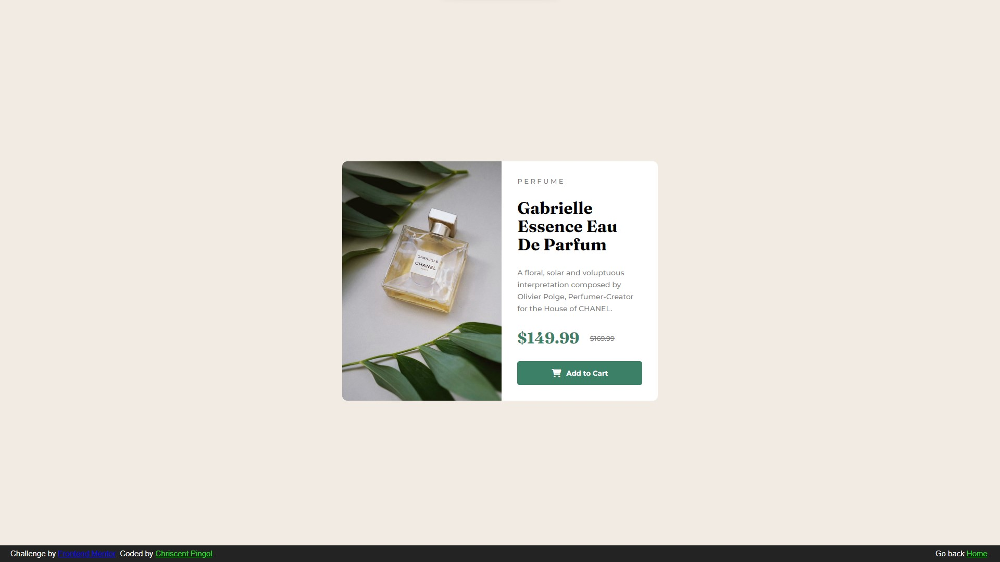

# Frontend Mentor - Product preview card component solution

This is a solution to the [Product preview card component challenge on Frontend Mentor](https://www.frontendmentor.io/challenges/product-preview-card-component-GO7UmttRfa). Frontend Mentor challenges help you improve your coding skills by building realistic projects. 

## Table of contents

- [Overview](#overview)
  - [The challenge](#the-challenge)
  - [Screenshot](#screenshot)
  - [Links](#links)
- [My process](#my-process)
  - [Built with](#built-with)
  - [What I learned](#what-i-learned)
  - [Continued development](#continued-development)
  - [Useful resources](#useful-resources)
- [Author](#author)


## Overview

### The challenge

Users should be able to:

- View the optimal layout depending on their device's screen size
- See hover and focus states for interactive elements

### Screenshot



### Links

- Solution URL: [Solution URL here](https://github.com/KishonShrill/ApplyingMyKnowledge/tree/master/homepage/projects)
- Live Site URL: [Live site URL here](https://kishonshrill.github.io/ApplyingMyKnowledge/homepage/projects/product-preview-card-component.html)

## My process

I used flexbox because it is an easy way to center containers and images on the screen (Not because I haven't mastered grid yet 🥹) then on the mobile version, used object-fit to crop the image to the desired height and weight without stretching the image.

### Built with

- Semantic HTML5 markup
- CSS custom properties
- Flexbox
- Mobile-first workflow

### What I learned

I have learned that an easy way to crop an image is by using the object-fit property in css. Learned that the hard way and had to browse for an hour to find the correct solution to surfing in StackOverflow to arriving in [The answer to my problem](https://developer.mozilla.org/en-US/docs/Web/CSS/object-fit)

```css
.card img {
  height: 300px;
  object-fit: cover;
  border-radius: 10px 10px 0px 0px;
}
```

### Useful resources

- [developer.mozilla.org - object-fit](https://developer.mozilla.org/en-US/docs/Web/CSS/object-fit) - This helped me in cropping the image.
- [w3schools](https://www.w3schools.com/) - Helped me remember the syntax and markup to use in html and css.


## Author

- Website - [Chriscent Pingol](https://kishonshrill.github.io/ApplyingMyKnowledge/homepage/index.html)
- Frontend Mentor - [@KishonShrill](https://www.frontendmentor.io/profile/KishonShrill)

